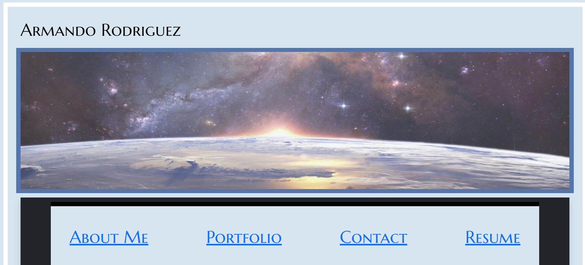
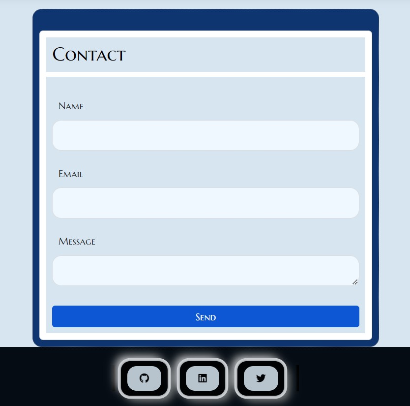

# React Portfolio

## Description

A short description explaining the what, why, and how of project "Text Editor":

A React portfolio where I can share my projects, to include shairng with fellow developers and collaborate on future projects.

Just as you did in the module project, the application is also deployed to GitHub Pages. 

## User Story

AS AN employer looking for candidates with experience building single-page applications

I WANT to view a potential employee's deployed React portfolio of work samples

SO THAT I can assess whether they're a good candidate for an open position

## Acceptance Criteria

GIVEN a single-page application portfolio for a web developer

WHEN I load the portfolio

THEN I am presented with a page containing a header, a section for content, and a footer

WHEN I view the header

THEN I am presented with the developer's name and navigation with titles corresponding to different sections of the portfolio

WHEN I view the navigation titles

THEN I am presented with the titles About Me, Portfolio, Contact, and Resume, and the title corresponding to the current section is highlighted

WHEN I click on a navigation title

THEN I am presented with the corresponding section below the navigation without the page reloading and that title is highlighted

WHEN I load the portfolio the first time

THEN the About Me title and section are selected by default

WHEN I am presented with the About Me section

THEN I see a recent photo or avatar of the developer and a short bio about them

WHEN I am presented with the Portfolio section

THEN I see titled images of six of the developer’s applications with links to both the deployed applications and the corresponding GitHub repository

WHEN I am presented with the Contact section

THEN I see a contact form with fields for a name, an email address, and a message

WHEN I move my cursor out of one of the form fields without entering text

THEN I receive a notification that this field is required

WHEN I enter text into the email address field

THEN I receive a notification if I have entered an invalid email address

WHEN I am presented with the Resume section

THEN I see a link to a downloadable resume and a list of the developer’s proficiencies

WHEN I view the footer

THEN I am presented with text or icon links to the developer’s GitHub and LinkedIn profiles, and their profile on a third platform (Stack Overflow, Twitter) 


## Installation

Pulling the GitHub repository from the follwing URL: https://github.com/RamRod79/react-portfolio.git and typing the follwoing command ,'npm install', in the terminal will ensure the dependencies are installed and the program can run properly.

- Clone the repository to your own local machine and run it from your command line.

- Run ```npm i``` or ```npm install``` in order to download all the dependencies.

### `npm start`

Runs the app in the development mode.\
Open [http://localhost:3000](http://localhost:3000) to view it in your browser.

The page will reload when you make changes.\
You may also see any lint errors in the console.

## Deployed Link

The link to the deployed application is:  https://RamRod79.github.io/react-portfolio.

## Usage







## Credits

List of collaborators:

- UCLA Extension, Coding Bootcamp Instructor and TAs

## License

The following licenses have been used in the development of this project:

[](https://opensource.org/licenses/MIT)

## Badges


## How to Contribute

If other developers would like to contribute, you can contact me at armando.rod79@gmail.com.

## URL
GitHub: https://github.com/RamRod79/react-portfolio.git

Deployed URL: https://RamRod79.github.io/react-portfolio

## Contact Info

For any other issues or comments please contact me at:

GitHub username: RamRod79

Email: armando.rod79@gmail.com